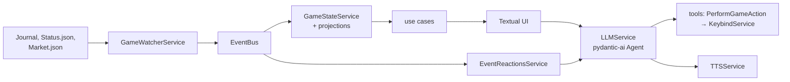

# Contributing to EDCeleste

Contributions are welcome! Here's how to get started.

## Getting Started

1. Fork the repository
2. Create a feature branch: `git checkout -b feature/your-feature`
3. Make your changes
4. Run the type check and tests: `mypy` and `coverage run -m pytest`
5. Commit with a clear message
6. Push and open a Pull Request

## Guidelines

- Keep PRs focused on a single change
- Add tests for new functionality
- Follow existing code style and project structure
- Use Pydantic models for data validation
- Update documentation if your change affects usage

## How the code is organised

All source lives under `src/edceleste/`.

| Folder | What lives there |
|--------|------------------|
| `services/` | Core services. Each one has `cold_start()` (the start-up check), `validate_settings()` and `reload_service()`. |
| `services/models/` | Pydantic models for game events, settings and stats. |
| `projection/` | One projection per slice of the game state (player, location, fuel, ship, loadout, market). |
| `adapters/tools/` | Tools the LLM can call. `pydantic-ai` reads the arguments from `execute` and the description from its docstring. |
| `protocols/` | Protocols the UI and use cases depend on instead of concrete services. |
| `use_cases/` | Thin callables between services and the UI, grouped by screen. |
| `containers/` | One `dependency-injector` container that wires everything. |
| `ui/` | The Textual app: one folder per screen, shared widgets, `css.tcss`. |

### Adding a new game event

1. Add a Pydantic model in `services/models/game_events.py`.
2. Register it in `JournalEventType` and the `JournalEvent` union in `services/models/journal_event.py`.
3. Handle it in the relevant projection. `tests/projection/test_recognized_events_feed_game_state.py` fails when a recognised event is not handled by any projection.

## Reporting Issues

Open an issue with:
- A clear description of the problem or suggestion
- Steps to reproduce (for bugs)
- Expected vs actual behavior

## Code of Conduct

Be respectful and constructive. We're all here because we love Elite Dangerous.
