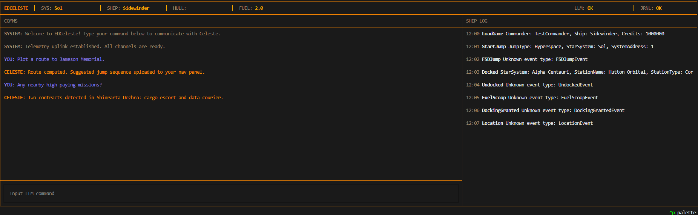

# EDCeleste

LLM-powered terminal-like copilot for Elite Dangerous with a voice interface (planned).

Celeste is an AI companion that reacts to in-game events in real time and acts like a human co-pilot. She reads the game's journal, keeps a live picture of your ship and location, and answers questions with that context in mind.

> **Status:** Active development — real-time journal parsing, game-state projections, a Textual dashboard, and an LLM co-pilot chat are working. STT/TTS voice and in-game action tooling are still planned.

## Features

**Working today:**

- **Real-time journal ingestion** — `JournalWatcherService` finds the latest `Journal*.log`, tails it, and parses each line into typed Pydantic models published on an in-process event bus.
- **Typed event parsing** — a discriminated union covers game load, travel and location (`FSDJump`, `StartJump`, `Location`, `SupercruiseEntry/Exit`, `ApproachBody`, `LeaveBody`, `ApproachSettlement`), docking (`Docked`, `Undocked`, `DockingGranted`), fuel (`FuelScoop`, `RefuelAll`, `ReservoirReplenished`), and commander progression (`Commander`, `Rank`, `Promotion`, `Reputation`, `Died`, `Resurrect`). Unrecognised events fall back to `UnknownCheckedEvent` instead of crashing.
- **Game-state projections** — dedicated projections track the player (name, credits, ship, combat/trade/exploration ranks, faction reputation, alive/rebuy state), location (current system, docked station, supercruise, nearby body/settlement, active FSD jump), and fuel level/capacity. `GameStateService` aggregates them into a text snapshot that grounds the LLM.
- **LLM co-pilot (Celeste)** — `LLMService` uses LangChain + Anthropic (`claude-haiku-4-5`) with a structured response schema, running conversation history, and the current game state injected into each prompt. Responses and thinking/idle status are streamed to the UI.
- **Textual TUI dashboard** — an amber-themed grid with:
  - a header showing live **SYS / SHIP / FUEL** stats plus **LLM / JRNL** health indicators (`OK` / `FAIL`),
  - a **COMMS** chat panel where you type commands and watch Celeste's streamed replies,
  - a **SHIP LOG** panel that streams journal events as they arrive.
- **Health checks** — the journal watcher and the LLM endpoint are polled and surfaced live in the header.
- **Optional LangSmith tracing** — enable via env vars to inspect LLM traces.

> The dashboard can run against live journal files (`JournalWatcherService`) or a bundled sample event stream (`JournalWatcherServiceStub`, used by default during UI development).

**Planned:** STT/TTS voice interface, keystroke/game-action tooling, and EDMC / Galnet / E:D API lookups.



## Setup

**Requirements:** Python 3.12+, Elite Dangerous (PC)

```bash
git clone https://github.com/IqSantiagow/EDCeleste
cd EDCeleste
python -m venv .venv
.venv/Scripts/activate     # Windows
source .venv/bin/activate  # Linux/macOS
pip install -r requirements.txt
```

## Configuration

Copy and edit the env file:

```bash
cp .env-example .env
```

Required variables (double-underscore denotes nesting, parsed by pydantic-settings):

- `ED__MAIN_PATH` — your Elite Dangerous journal directory (typically `C:\Users\<you>\Saved Games\Frontier Developments\Elite Dangerous`)
- `LLM__ANTHROPIC_API_KEY` — your Anthropic API key
- `ED__LOGGING__LEVEL` — `DEBUG` | `INFO` | `WARNING` | `ERROR` | `CRITICAL`

Optional LangSmith tracing: set `LANGSMITH__TRACING=true` and provide `LANGSMITH__API_KEY`.

## Usage

```bash
python app.py
```

## Development

```bash
# Lint
ruff check
ruff format --diff        # check only; drop --diff to auto-fix

# Tests with coverage
coverage run -m unittest discover
coverage report -m

# Run a single test file
python -m pytest tests/services/journal/test_journal_watcher.py
```

## Debugging

Run the console in a separate terminal to see logs and events:

```bash
textual console -x EVENT --port 5000
```

Run the app in dev mode so it connects to that console:

```bash
textual run --dev --port 5000 app.py
```

## Architecture

```
ED journal files → JournalWatcherService → EventBus → Projections → GameStateService
                                                                          ↓
                                UIApp (Textual TUI) ← EdDashboardPresenter ← use_cases
                                                                          ↓
                                                                     LLMService
```

- `services/` — core services: event bus, journal watcher, game state, LLM.
- `projection/` — per-concern projections (player, location, fuel) that build the LLM's game-state snapshot.
- `use_cases/` — thin callables bridging the game/LLM state to UI view models.
- `containers/` — a single `dependency-injector` container wiring everything together.
- `ui/` — the Textual TUI (dashboard widgets, screens, themes, CSS).
- `config/` — pydantic-settings config loading and LangSmith setup.

## Project Structure

```
EDCeleste/
├── app.py                 # Entry point
├── config/                # Config loading (pydantic-settings + .env), tracing
├── containers/            # dependency-injector wiring
├── projection/            # Event projections (fuel, location, player)
├── protocols/             # Structural protocols (game state, journal, LLM)
├── services/              # Core services (journal watcher, event bus, LLM, game state)
│   ├── event_bus.py       # Pub/sub event bus
│   ├── models/            # Pydantic models for journal events
│   └── stubs/             # Sample event stream for UI development
├── use_cases/             # UI-facing use cases (streaming stats, events, LLM)
├── ui/                    # Textual TUI (widgets, screens, themes, css.tcss)
├── tools/                 # Tool integrations (planned)
└── tests/                 # Tests
```

## Contributing

See [CONTRIBUTING.md](CONTRIBUTING.md) for guidelines.

## License

[MIT](LICENSE)
