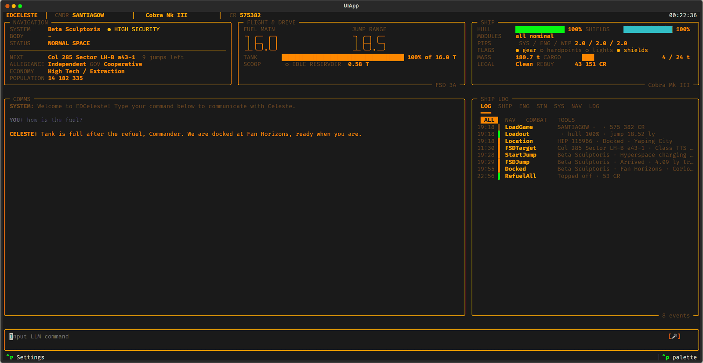
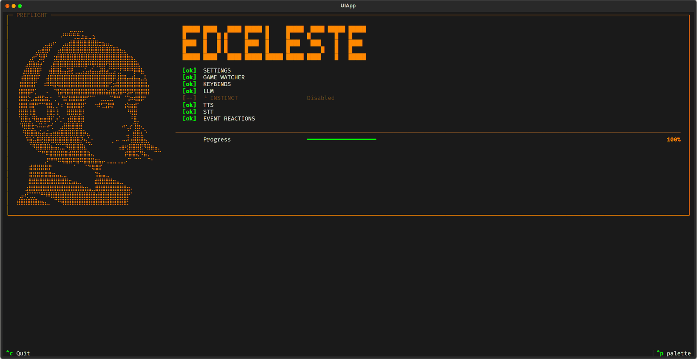
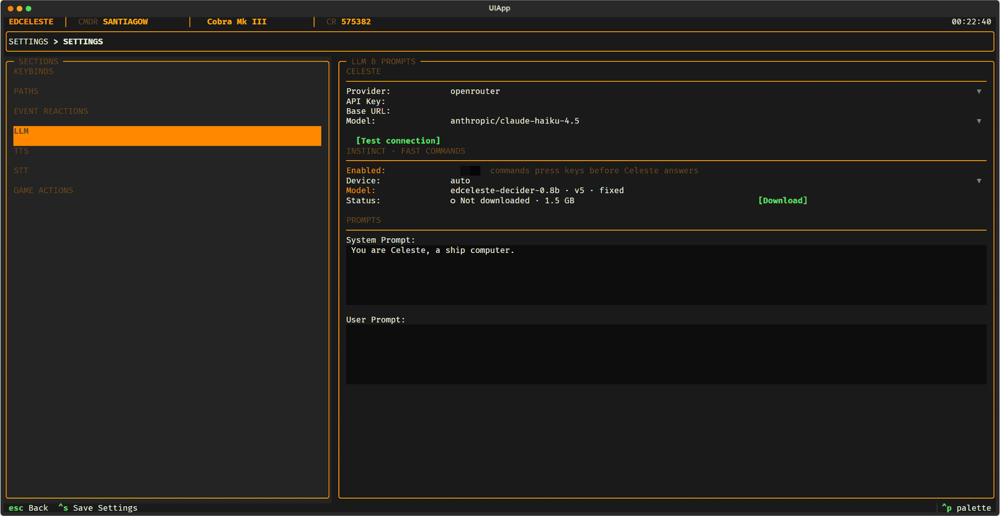
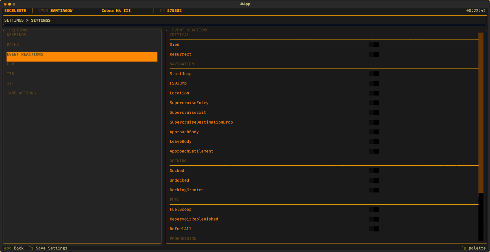
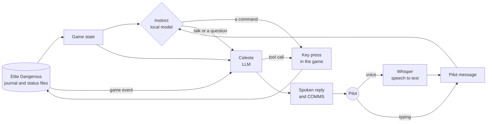
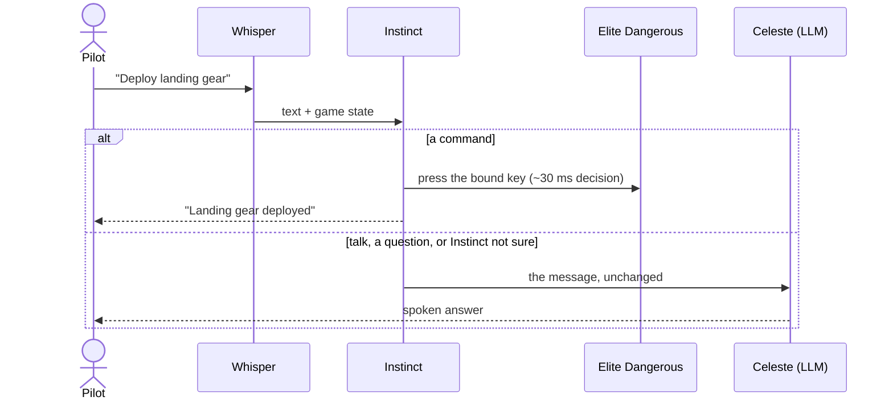
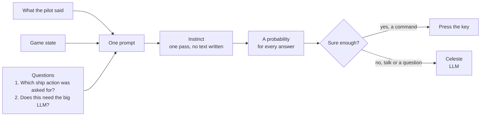
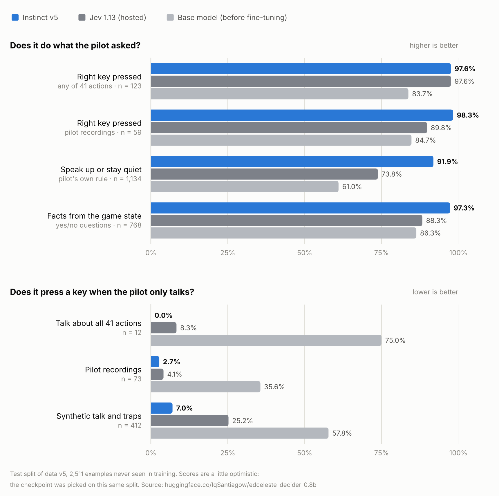

<p align="center">
  <picture>
    <source media="(prefers-color-scheme: dark)" srcset="docs/celeste-logo-dark.png">
    
  </picture>
</p>

# EDCeleste

A voice co-pilot for Elite Dangerous that lives in your terminal.

Celeste follows your game as it happens, talks with you, and presses keys for you. Say "deploy landing gear" and the gear moves. Ask "how much fuel do I have?" and she answers from what the game just wrote.



> **Status:** in active development. The game state, the LLM co-pilot, voice in and out, key presses and event reactions work today. Instinct, the local model for fast commands, is being wired in ([M1 · Fast commands](https://github.com/IqSantiagow/EDCeleste/issues/154)).

## What Celeste does

- **Knows your game.** She reads the game's journal and status files live: where you are, what you fly, your fuel, cargo and the station market. Every answer starts from that picture.
- **Listens.** Speak instead of typing. A local Whisper model turns speech into text on your machine, primed with Elite Dangerous vocabulary.
- **Talks back.** Replies are spoken with a Microsoft Edge voice, or with your own cloned voice running locally (Chatterbox). Voice profiles are recorded and managed in the app. Voice Lab makes her sound like she speaks inside the ship: a sharper voice, a short cabin reverb and stereo width, each on its own slider.
- **Presses keys.** She uses your own keybindings and presses keys only into the game window, never into the terminal. Off until you switch it on.
- **Reacts quickly to commands (Instinct).** A small model on your own machine recognises commands in about 30 ms and presses the key without waiting for the LLM. Everything else goes to Celeste.
- **Reacts to the game.** Pick the game events Celeste should speak up about, for example loading into the game or docking.
- **Works with any LLM.** OpenRouter by default; Anthropic, OpenAI, Google, Groq, Mistral or a local Ollama / vLLM server work from settings alone.
- **Runs in the terminal.** A start-up check, a cockpit dashboard with navigation, ship and comms panels, and a settings screen that checks every change before saving it.

## Screenshots

The app running on a recorded game journal: a jump to Beta Sculptoris, docking at Fan Horizons and a refuel.

**Start-up check.** Every service is checked before the dashboard opens: settings, the game journal, keybindings, the LLM, Instinct, voice out and in, and event reactions.



**Settings.** The LLM provider and model with a connection test, Instinct and its model download, the prompts, and the game events Celeste speaks up about.

| LLM and Instinct | Event reactions |
| --- | --- |
|  |  |

## How it works

### The big picture


```mermaid
flowchart LR
    Game[("Elite Dangerous<br/>journal and status files")] --> State["Game state"]
    Pilot(("Pilot")) -- "voice" --> STT["Whisper<br/>speech to text"]
    STT --> Message["Pilot message"]
    Pilot -- "typing" --> Message
    Message --> Instinct{"Instinct<br/>local model"}
    State --> Instinct
    Instinct -- "a command" --> Keys["Key press<br/>in the game"]
    Instinct -- "talk or a question" --> Celeste["Celeste<br/>LLM"]
    State --> Celeste
    Game -- "game event" --> Celeste
    Celeste -- "tool call" --> Keys
    Celeste --> Voice["Spoken reply<br/>and COMMS"]
    Keys --> Game
    Voice --> Pilot
```

The game state is the one picture of the game every part works from. It is rebuilt from the game's files the moment the game writes them.

### A voice command

Today every message goes to the LLM, which takes 5–6 seconds for a single key press. With Instinct, a command takes about a second:


```mermaid
sequenceDiagram
    actor Pilot
    participant STT as Whisper
    participant Instinct
    participant Game as Elite Dangerous
    participant Celeste as Celeste (LLM)

    Pilot->>STT: "Deploy landing gear"
    STT->>Instinct: text + game state
    alt a command
        Instinct->>Game: press the bound key (~30 ms decision)
        Instinct-->>Pilot: "Landing gear deployed"
    else talk, a question, or Instinct not sure
        Instinct->>Celeste: the message, unchanged
        Celeste-->>Pilot: spoken answer
    end
```

Instinct presses a key only when it is confident. When it is unsure, not downloaded yet, or too slow, the message goes to Celeste as it always did, so nothing gets worse when it is off.

### Who handles what

| The pilot says or the game does         | Who handles it                                      |
|-----------------------------------------|-----------------------------------------------------|
| "Deploy landing gear"                   | Instinct presses the key                            |
| "How much fuel do I have?"              | Celeste answers                                     |
| "The landing gear looks nice"           | Celeste answers, no key is pressed                  |
| "Deploy the gear and tell me which pad" | Instinct presses the key, Celeste answers the rest (planned, M1.2) |
| A game event you switched on            | Celeste speaks up                                   |
| A game event with your own rule         | The rule presses a key or says a line at once (planned, M3) |

## Instinct, the decision model

Instinct is the small model that decides who handles a message: a key press right now, or Celeste. It is [`IqSantiagow/edceleste-decider-0.8b`](https://huggingface.co/IqSantiagow/edceleste-decider-0.8b), a 0.8B model fine-tuned on Elite Dangerous commands. It knows all 41 ship actions the app can press.

### How it decides

Instinct is not a chatbot and never writes a sentence. It reads the game state and what the pilot said, gets a few questions, and answers every question with a probability. All of it happens in one pass through the model.


```mermaid
flowchart LR
    Said["What the pilot said"] --> Prompt["One prompt"]
    State["Game state"] --> Prompt
    Questions["Questions<br/>1. Which ship action was asked for?<br/>2. Does this need the big LLM?"] --> Prompt
    Prompt --> Model["Instinct<br/>one pass, no text written"]
    Model --> Odds["A probability<br/>for every answer"]
    Odds --> Sure{"Sure enough?"}
    Sure -- "yes, a command" --> Key["Press the key"]
    Sure -- "no, talk or a question" --> Celeste["Celeste<br/>LLM"]
```

- **Every question is multiple choice.** For a command, the options are the actions the pilot has bound, plus `none`. The model scores one letter per option and the scores become probabilities. It cannot answer outside the list, so it cannot press a key that does not exist.
- **The probability is the point.** "97% sure it is the landing gear" presses the key. "40% sure" does not, and the message goes to Celeste, as it did before Instinct.
- **The list can change.** It was trained on random subsets of 5 to 42 actions, in random order, with `none` last, so it learns to choose from whatever list it is given.
- **A second question guards the door.** `needs_llm` asks whether the message needs knowledge, planning or conversation. "How much fuel do I have?" goes to Celeste, not to a key.

The same model answers the other questions the app will ask it: whether Celeste should speak up about a game event under the pilot's own rule ([M3](https://github.com/IqSantiagow/EDCeleste/issues/156)), and yes/no facts about the ship ("is the landing gear down?"), so toggles can check the state before pressing ([M1.3](https://github.com/IqSantiagow/EDCeleste/issues/113)).

### How well it decides

The chart compares Instinct with the base model it started from, and with Jev 1.13, a hosted decision model of the same kind (questions in, probabilities out) used as the reference. All three were scored on a test split of 2,511 examples that were never in training.

<picture>
  <source media="(prefers-color-scheme: dark)" srcset="docs/instinct-accuracy-dark.png">
  
</picture>

- **It picks the right key as often as the hosted reference, and more often in real speech.** 120 of 123 phrases across all 41 actions (Jev: 120) and 58 of 59 in recordings of a pilot speaking (Jev: 53).
- **It stays quiet when the pilot only talks.** This matters most in a game, because a wrong key press in a fight costs more than a slow answer. Instinct pressed a key on 2 of 73 talking lines in the recordings and on 29 of 412 synthetic lines of talk and trap sentences (negations, "why" and "how" questions, past tense, reminders). The base model did it 26 and 238 times.
- **It follows the pilot's own rules.** It decides correctly 91.9% of the time whether Celeste should speak up about an event under an instruction like "only tell me if my shields are down", against 73.8% for Jev.

<details>
<summary>The numbers behind the chart</summary>

| Test | Instinct v5 | Jev 1.13 | Base model |
|---|---|---|---|
| Right key pressed, all 41 actions | 120/123 (97.6%) | 120/123 (97.6%) | 103/123 (83.7%) |
| Right key pressed, pilot recordings | 58/59 (98.3%) | 53/59 (89.8%) | 50/59 (84.7%) |
| Speak up or stay quiet, pilot's own rule | 1042/1134 (91.9%) | 837/1134 (73.8%) | 692/1134 (61.0%) |
| Facts from the game state | 747/768 (97.3%) | 678/768 (88.3%) | 663/768 (86.3%) |
| Key pressed on talk, all 41 actions (lower is better) | 0/12 (0.0%) | 1/12 (8.3%) | 9/12 (75.0%) |
| Key pressed on talk, pilot recordings (lower is better) | 2/73 (2.7%) | 3/73 (4.1%) | 26/73 (35.6%) |
| Key pressed on synthetic talk and traps (lower is better) | 29/412 (7.0%) | 104/412 (25.2%) | 238/412 (57.8%) |

</details>

> **Read these numbers as a good sign, not a guarantee.** The checkpoint was picked by loss on this same test split, and one recording session was looked at while the data was built, so the scores are somewhat optimistic. The set of talking lines for all 41 actions has only 12 lines. A fresh recording session (94 new prompts covering all 41 actions) is the clean test and is still to be done.

### What it costs

| Who decides | Where it runs | Time to decide |
|---|---|---|
| Instinct on the GPU | your machine | about 35 ms for one question, about 125 ms for twelve |
| Instinct on the CPU | your machine | about 2 s |
| Jev 1.13 | hosted, over the network | about 330 ms |
| Celeste (the LLM) | your LLM provider | about 1.6 s to the first word, 4.3 s at the 95th percentile |

A command is one multiple-choice question plus `needs_llm`, so it lands between the one-question and twelve-question times.

**What it does to the game:**

- **Memory.** Instinct needs about 2 GB of GPU memory. In the benchmark Elite Dangerous took 5.8–6.6 GB of a 12 GB card, which left 4–5 GB. Bigger decision models were tried: a 4B-class one did not fit next to the game, and a 2B one fit but decided worse. That is why Instinct is 0.8B.
- **Frame rate.** Not measured yet. Only decision time and memory were measured, not what the game's frame time does while a decision runs. The CPU option is there for anyone who wants the GPU left alone.
- **Start-up.** The first decision after loading compiles the model (about 30 s), so the app warms it up while it starts. Later decisions are fast.

<sub>Where the numbers come from: the GPU figures are from a benchmark on an RTX 3080 Ti with Elite Dangerous running, using the base decider-0.8b, which has the same size and architecture as Instinct. They include the Triton and flash-linear-attention kernels; without them expect about 50 ms and 190 ms. The Jev and Celeste figures were measured on 19 September; the Celeste model was a free OpenRouter model, so its spread is wide. At log level `INFO` the app logs every decision with its time (`Decision model: ... in N ms`). That is the number to trust on your machine.</sub>

### Using it

- Switch it on in **Settings → LLM → Instinct**. The model (1.5 GB) is downloaded the first time; after that it needs no network and no API key.
- It runs on the GPU or on the CPU. The GPU memory is shared with the game, so you may want to keep it free.

<details>
<summary>How it was trained</summary>

Instinct starts from [Mapika/decider-0.8b](https://huggingface.co/Mapika/decider-0.8b) (Apache 2.0), a Qwen3.5-0.8B model built to return calibrated probabilities instead of text.

- **Training:** LoRA (rank 32) in Unsloth Studio, one epoch, about 57 minutes on one RTX 3080 Ti. The checkpoint at step 1350 of 1690 had the lowest eval loss and is the one that shipped.
- **Data:** 8,459 examples, 2,511 of them held out for testing. Each of the 41 actions has 8–9 phrasings, with slang (FA, FSD, SCB, pips) and pairs that are easy to mix up (next and previous target, comms and quick comms, cargo scoop and jettison). The data also has speech-to-text slips, recordings of a real pilot, trap sentences that mention an action without asking for it, reaction rules and facts read from the game state.
- **Five rounds:** each one fixed what the last got wrong. v3 pressed keys on talking lines such as questions and negations, v4 added trap sentences for that, and v5 grew from 12 actions to all 41 and replaced one yes/no question per action with a single multiple-choice question.

The [model card](https://huggingface.co/IqSantiagow/edceleste-decider-0.8b) has the exact recipe and the scores.

</details>

## Roadmap

| Milestone | What the pilot gets |
|-----------|---------------------|
| [M1 · Fast commands](https://github.com/IqSantiagow/EDCeleste/issues/154) | A command happens in about a second and Celeste confirms it, without waiting for the LLM. |
| [M2 · Celeste knows the game](https://github.com/IqSantiagow/EDCeleste/issues/155) | From the first second Celeste knows the route, cargo and modules, and follows a game restart. |
| [M3 · Reflex API](https://github.com/IqSantiagow/EDCeleste/issues/156) | One list of reactions: an instant rule, or Celeste judging the moment with your own prompt. |
| [M4 · Cockpit cards](https://github.com/IqSantiagow/EDCeleste/issues/139) | Cards for the ship, route, station and system next to the conversation. |

## Getting started

**You need:** Windows 10 or 11, Python 3.12+ and Elite Dangerous (PC). An NVIDIA GPU is optional; it makes Instinct and the cloned voice fast.

```bash
git clone https://github.com/IqSantiagow/EDCeleste
cd EDCeleste
python -m venv .venv
.venv/Scripts/activate
pip install -e .
# Instinct needs newer Hugging Face libraries than the voice cloning package pins
pip install --no-deps transformers==5.18.0 tokenizers==0.23.2 safetensors==0.8.0 huggingface_hub==1.33.0
cp .env-example .env
```

Start it from the repo root:

```bash
edceleste
```

The first start creates `config.yaml` and asks you to fill in three things, then restart:

- `paths.journal_path`: your journal folder, usually `C:\Users\<you>\Saved Games\Frontier Developments\Elite Dangerous`
- `paths.keybindings_path`: your bindings folder, usually `C:\Users\<you>\AppData\Local\Frontier Developments\Elite Dangerous\Options\Bindings`
- `llm.provider.api_key`: the key of your LLM provider (OpenRouter by default)

Everything else, including voice, microphone, reactions, key presses and Instinct, is set in the app under **Settings** (`Ctrl+R`). `config-example.yaml` shows every option.

| Key      | Where     | Action                            |
|----------|-----------|-----------------------------------|
| `Ctrl+R` | Dashboard | Open settings                     |
| `Ctrl+E` | Dashboard | Toggle the ship log to full width |
| `Ctrl+S` | Settings  | Check and save settings           |
| `Esc`    | Settings  | Back to the dashboard             |
| `Ctrl+C` | Anywhere  | Quit                              |

## Development

```bash
pip install -e ".[dev,test]"

ruff check
ruff format --diff
mypy
coverage run -m pytest
```

To see logs and events live, run `textual console -x EVENT --port 7342` in one terminal and `textual run --dev --port 7342 -c edceleste` in another.

How the code is organised, and how to add a new game event, is in [CONTRIBUTING.md](CONTRIBUTING.md).

## License

[MIT](LICENSE)
