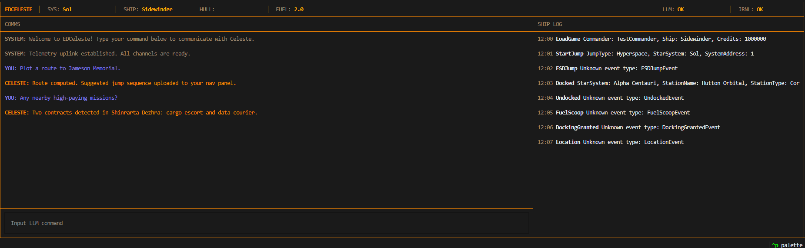
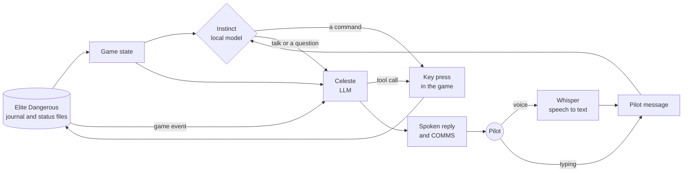
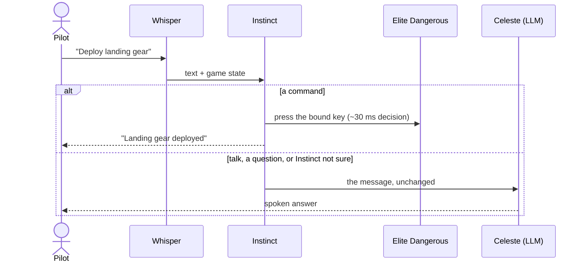

# EDCeleste

A voice co-pilot for Elite Dangerous that lives in your terminal.

Celeste follows your game as it happens, talks with you, and presses keys for you. Say "deploy landing gear" and the gear moves. Ask "how much fuel do I have?" and she answers from what the game just wrote.



> **Status:** in active development. The game state, the LLM co-pilot, voice in and out, key presses and event reactions work today. Instinct, the local model for fast commands, is being wired in ([M1 · Fast commands](https://github.com/IqSantiagow/EDCeleste/issues/154)).

## What Celeste does

- **Knows your game.** She reads the game's journal and status files live: where you are, what you fly, your fuel, cargo and the station market. Every answer starts from that picture.
- **Listens.** Speak instead of typing. A local Whisper model turns speech into text on your machine, primed with Elite Dangerous vocabulary.
- **Talks back.** Replies are spoken with a Microsoft Edge voice, or with your own cloned voice running locally (Chatterbox). Voice profiles are recorded and managed in the app.
- **Presses keys.** She uses your own keybindings and presses keys only into the game window, never into the terminal. Off until you switch it on.
- **Reacts quickly to commands (Instinct).** A small model on your own machine recognises commands in about 30 ms and presses the key without waiting for the LLM. Everything else goes to Celeste.
- **Reacts to the game.** Pick the game events Celeste should speak up about, for example loading into the game or docking.
- **Works with any LLM.** OpenRouter by default; Anthropic, OpenAI, Google, Groq, Mistral or a local Ollama / vLLM server work from settings alone.
- **Runs in the terminal.** A start-up check, a cockpit dashboard with navigation, ship and comms panels, and a settings screen that checks every change before saving it.

## How it works

### The big picture


```mermaid
flowchart LR
    Game[("Elite Dangerous<br/>journal and status files")] --> State["Game state"]
    Pilot(("Pilot")) -- "voice" --> STT["Whisper<br/>speech to text"]
    STT --> Message["Pilot message"]
    Pilot -- "typing" --> Message
    Message --> Instinct{"Instinct<br/>local model"}
    State --> Instinct
    Instinct -- "a command" --> Keys["Key press<br/>in the game"]
    Instinct -- "talk or a question" --> Celeste["Celeste<br/>LLM"]
    State --> Celeste
    Game -- "game event" --> Celeste
    Celeste -- "tool call" --> Keys
    Celeste --> Voice["Spoken reply<br/>and COMMS"]
    Keys --> Game
    Voice --> Pilot
```

The game state is the one picture of the game every part works from. It is rebuilt from the game's files the moment the game writes them.

### A voice command

Today every message goes to the LLM, which takes 5–6 seconds for a single key press. With Instinct, a command takes about a second:


```mermaid
sequenceDiagram
    actor Pilot
    participant STT as Whisper
    participant Instinct
    participant Game as Elite Dangerous
    participant Celeste as Celeste (LLM)

    Pilot->>STT: "Deploy landing gear"
    STT->>Instinct: text + game state
    alt a command
        Instinct->>Game: press the bound key (~30 ms decision)
        Instinct-->>Pilot: "Landing gear deployed"
    else talk, a question, or Instinct not sure
        Instinct->>Celeste: the message, unchanged
        Celeste-->>Pilot: spoken answer
    end
```

Instinct presses a key only when it is confident. When it is unsure, not downloaded yet, or too slow, the message goes to Celeste as it always did, so nothing gets worse when it is off.

### Who handles what

| The pilot says or the game does         | Who handles it                                      |
|-----------------------------------------|-----------------------------------------------------|
| "Deploy landing gear"                   | Instinct presses the key                            |
| "How much fuel do I have?"              | Celeste answers                                     |
| "The landing gear looks nice"           | Celeste answers, no key is pressed                  |
| "Deploy the gear and tell me which pad" | Instinct presses the key, Celeste answers the rest (planned, M1.2) |
| A game event you switched on            | Celeste speaks up                                   |
| A game event with your own rule         | The rule presses a key or says a line at once (planned, M3) |

### Instinct

Instinct is a 0.8B model fine-tuned on Elite Dangerous commands: [`IqSantiagow/edceleste-decider-0.8b`](https://huggingface.co/IqSantiagow/edceleste-decider-0.8b). It knows all 41 ship actions the app can press.

- Switch it on in **Settings → LLM → Instinct**. The model (1.5 GB) is downloaded the first time; after that it needs no network and no API key.
- It runs on the GPU (about 30 ms per command) or on the CPU (about 2 s), because the GPU memory is shared with the game and you may want to keep it free.

## Roadmap

| Milestone | What the pilot gets |
|-----------|---------------------|
| [M1 · Fast commands](https://github.com/IqSantiagow/EDCeleste/issues/154) | A command happens in about a second and Celeste confirms it, without waiting for the LLM. |
| [M2 · Celeste knows the game](https://github.com/IqSantiagow/EDCeleste/issues/155) | From the first second Celeste knows the route, cargo and modules, and follows a game restart. |
| [M3 · Reflex API](https://github.com/IqSantiagow/EDCeleste/issues/156) | One list of reactions: an instant rule, or Celeste judging the moment with your own prompt. |
| [M4 · Cockpit cards](https://github.com/IqSantiagow/EDCeleste/issues/139) | Cards for the ship, route, station and system next to the conversation. |

## Getting started

**You need:** Windows 10 or 11, Python 3.12+ and Elite Dangerous (PC). An NVIDIA GPU is optional; it makes Instinct and the cloned voice fast.

```bash
git clone https://github.com/IqSantiagow/EDCeleste
cd EDCeleste
python -m venv .venv
.venv/Scripts/activate
pip install -e .
# Instinct needs newer Hugging Face libraries than the voice cloning package pins
pip install --no-deps transformers==5.18.0 tokenizers==0.23.2 safetensors==0.8.0 huggingface_hub==1.33.0
cp .env-example .env
```

Start it from the repo root:

```bash
edceleste
```

The first start creates `config.yaml` and asks you to fill in three things, then restart:

- `paths.journal_path`: your journal folder, usually `C:\Users\<you>\Saved Games\Frontier Developments\Elite Dangerous`
- `paths.keybindings_path`: your bindings folder, usually `C:\Users\<you>\AppData\Local\Frontier Developments\Elite Dangerous\Options\Bindings`
- `llm.provider.api_key`: the key of your LLM provider (OpenRouter by default)

Everything else, including voice, microphone, reactions, key presses and Instinct, is set in the app under **Settings** (`Ctrl+R`). `config-example.yaml` shows every option.

| Key      | Where     | Action                            |
|----------|-----------|-----------------------------------|
| `Ctrl+R` | Dashboard | Open settings                     |
| `Ctrl+E` | Dashboard | Toggle the ship log to full width |
| `Ctrl+S` | Settings  | Check and save settings           |
| `Esc`    | Settings  | Back to the dashboard             |
| `Ctrl+C` | Anywhere  | Quit                              |

## Development

```bash
pip install -e ".[dev,test]"

ruff check
ruff format --diff
mypy
coverage run -m pytest
```

To see logs and events live, run `textual console -x EVENT --port 7342` in one terminal and `textual run --dev --port 7342 -c edceleste` in another.

How the code is organised, and how to add a new game event, is in [CONTRIBUTING.md](CONTRIBUTING.md).

## License

[MIT](LICENSE)
